# 📚 Lexify (Frontend & Backend)

Lexify is a modern e-book and language learning application that enhances the reading experience by providing instant word translations, pronunciations, and vocabulary tracking. You can easily learn unknown words while reading, add them to your favorites, and track your language progress.

This repository contains both the **Lexify Frontend (React Native)** and the **Lexify Backend (NestJS)** projects.

- **Frontend:** Mobile app for book-based language learning (React Native, Expo)
- **Backend:** RESTful API for user, book, word, and translation management (NestJS, PostgreSQL)

---

# Project Presentation

<!-- Visual frame for presentation images -->
<table align="center">
  <tr>
    <td></td>
    <td></td>
  </tr>
  <tr>
    <td></td>
    <td></td>
  </tr>
</table>

---

## 🎬 Demo Video

[](https://youtu.be/-W6wL4JQOPc "Lexify Demo Video ")

## 📑 Table of Contents

- [Project Structure](#project-structure)
- [Quick Start](#quick-start)
- [Backend Architecture (NestJS)](#-backend-architecture-nestjs)
- [Example Endpoints](#-example-endpoints)
- [How to Run the Backend](#-how-to-run-the-backend)
- [Frontend Features](#-features)
- [Screenshots](#-screenshots)
- [Folder Structure](#-folder-structure)
- [Main Technologies](#-main-technologies)
- [Installation](#-installation)
- [Multi-language Support](#-multi-language-support)
- [Main Screens & Flow](#-main-screens--flow)
- [Design & Components](#-design--components)
- [Links](#-links)
- [License](#-license)

## 🚀 Quick Start

### Frontend (React Native)

See full details below in this README.

- Go to `frontend/` and follow the installation steps.
- Run with `expo start`.

### Backend (NestJS)

See [backend/README.md](backend/README.md) for full documentation.

- Go to `backend/` and follow the installation steps.
- Run with `npm run start:dev` or use Docker.

---

## 🏗️ Backend Architecture (NestJS)

Lexify backend is a modular, scalable RESTful API built with [NestJS](https://nestjs.com/) and PostgreSQL. It provides all business logic, authentication, user/book/word management, translation, and file processing for the mobile app.

### Main Modules & Responsibilities

- **AuthModule:**

  - Handles user authentication (JWT, local, Google), login, logout, and profile endpoints.
  - Guards and strategies ensure secure access to protected resources.

- **UserModule:**

  - User registration, profile management, update/delete, and admin user listing.
  - Users have roles (admin/user) and are related to books, words, and progress.

- **BookModule:**

  - Book upload (PDF/EPUB), metadata management, per-user book listing, search, update, and delete.
  - Handles book content extraction and page/chapter management.

- **BookProgressModule:**

  - Tracks and updates the user's current page in each book.
  - Allows resuming reading from where the user left off.

- **WordModule (Favorites):**

  - Manages user's favorite words (add, list, remove).
  - Words are linked to users and have source/target language, translation, type, and category.

- **TranslationModule:**

  - Provides translation and dictionary lookup using a large local dictionary file.
  - Supports word search, translation, and dictionary statistics.

- **DictionaryModule:**

  - Exposes endpoints for searching the dictionary and retrieving stats.

- **FileModule:**

  - Handles file uploads (PDFs, images) and storage.

- **FeedbackModule:**
  - Allows users to submit feedback, which can be listed, updated, or deleted by admins.

### Entities & Data Model

- **User:**

  - id, name, email, password, role, provider
  - Relations: books, words (favorites), bookProgress

- **Book:**

  - id, title, author, coverImage, filePath, category, userId
  - Relations: user, pages, progress

- **Word:**

  - id, originalText, translatedText, sourceLanguage, targetLanguage, type, category
  - Relations: users (favorites)

- **BookProgress:**
  - Tracks current page per user per book

### API & Middleware

- **Global ValidationPipe:** Ensures DTO validation and request sanitization.
- **Global Exception Filter:** Handles and logs all unhandled exceptions, returns consistent error responses.
- **Swagger API Docs:** Available at `/api` after starting the backend.
- **CORS Enabled:** Allows frontend/mobile app to communicate securely.

### Configuration

- **TypeORM** for PostgreSQL connection and entity management.
- **ConfigModule** for environment variable management.
- **Entities** are auto-loaded and migrations are supported.

---

## 📑 Example Endpoints

- `POST /auth/login` — User login
- `GET /users/:id` — Get user profile
- `POST /books/upload/pdf` — Upload a new book (PDF)
- `GET /books` — List user's books
- `GET /books/:id/content?page=1` — Get book content by page
- `POST /favorites` — Add a word to favorites
- `GET /dictionary/search?query=word` — Search dictionary
- `POST /feedback` — Submit feedback

---

## 🗂️ How to Run the Backend

See [backend/README.md](backend/README.md) for full setup and environment instructions.

---

# 📚 Lexify Frontend (React Native)

Lexify is a mobile application that makes language learning fun and efficient, focusing on books and vocabulary. This repository contains the **React Native-based mobile interface** of the app.

---

## 🚀 Features

- 📖 **Book Reading:** Add and read books in PDF and EPUB formats.
- ⭐ **Save Words:** Select and save words as favorites while reading.
- 📚 **Dictionary & Translation:** Fast word search and translation support.
- 📝 **Profile & Statistics:** Track your personal progress and favorite words.
- 🌐 **Multi-language Support:** English and Turkish interface.
- 🖼️ **Modern & User-Friendly Design:** Stylish cards, icons, and themes.
- 🗂️ **Feedback & Settings:** Collect user feedback and manage app settings.

---

## 🖼️ Screenshots

App Flow: Login → Register → Navbar → Books → Add Book → Book Reader → Word Selector → Favorites → Profile → Dictionary → Settings → Help

| Login                                    | Register                                  | Navbar                                        | Books                                  |
| ---------------------------------------- | ----------------------------------------- | --------------------------------------------- | -------------------------------------- |
| 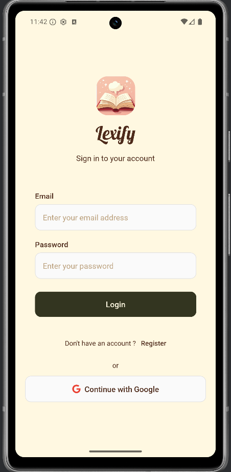           | 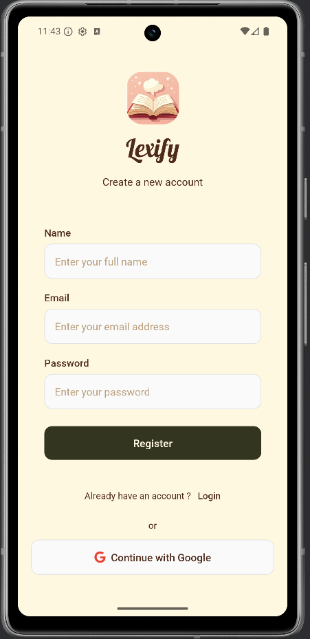      | 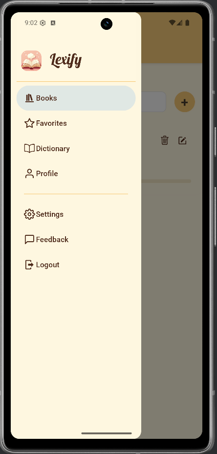              | 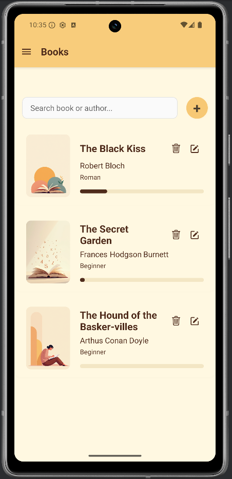         |
| Add to Book                              | Book Reader                               | Word Selector                                 | Favorites                              |
| 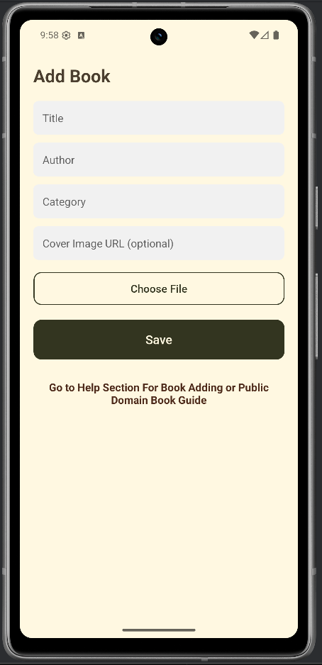 |  | 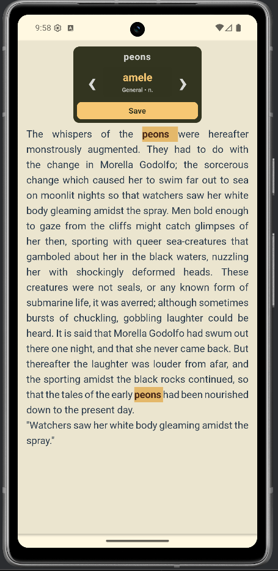 | 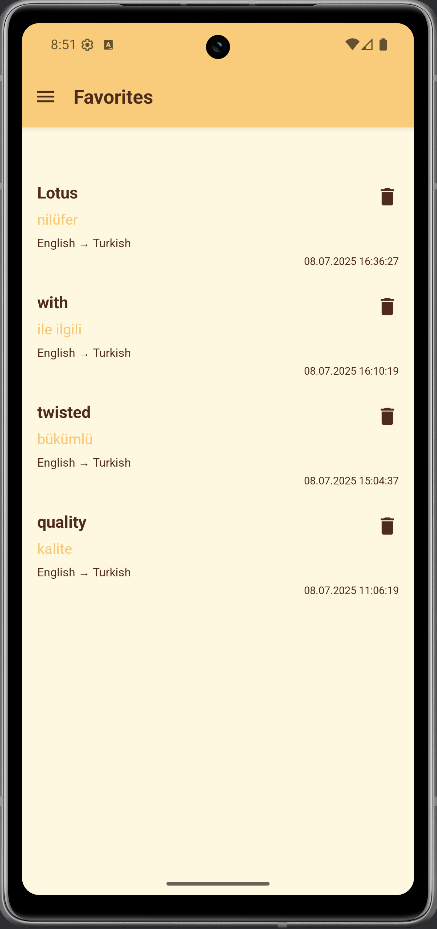 |
| Profile                                  | Dictionary                                | Settings                                      | Help                                   |
| 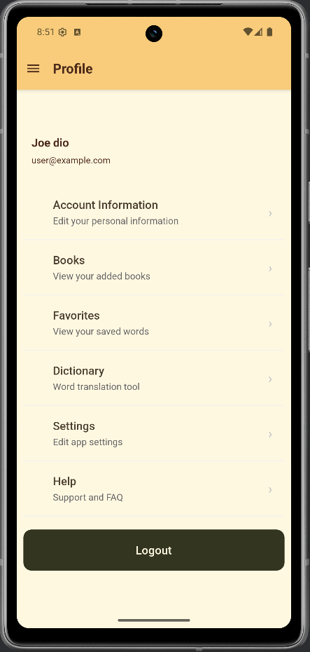       | 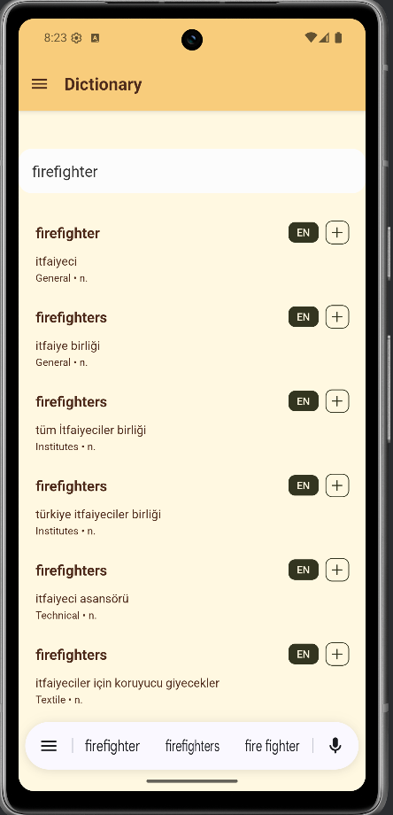  | 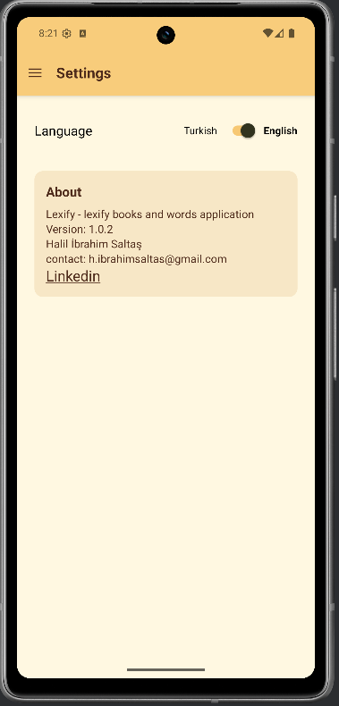          | 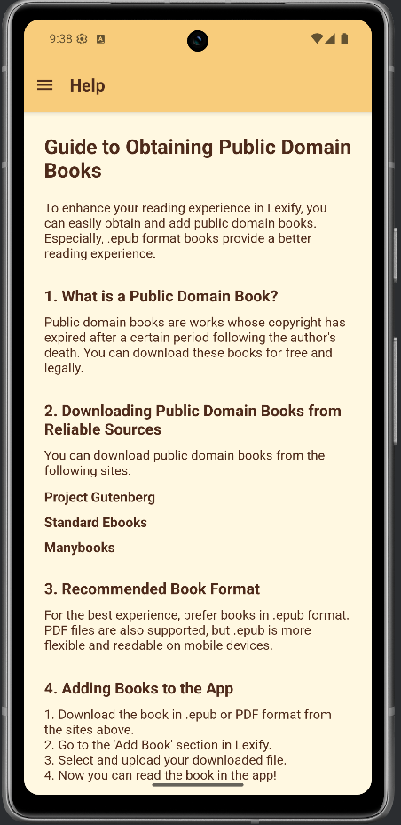           |

---

## 📁 Folder Structure

```
frontend/
├── src/
│   ├── assets/           # Images, icons, book covers
│   ├── components/       # UI components (BookCard, Button, Toast, etc.)
│   ├── contexts/         # Contexts for auth and language management
│   ├── hooks/            # Custom React hooks
│   ├── locales/          # Multi-language files (tr.json, en.json)
│   ├── navigation/       # Navigation (Drawer, Stack)
│   ├── screens/          # All screens (Books, AddBook, Help, etc.)
│   ├── services/         # API and data services
│   ├── types/            # Type definitions
│   └── config/           # App configuration
├── App.tsx               # Entry point
└── README.md             # This file
```

---

## 🛠️ Main Technologies

- **React Native** (Expo)
- **React Navigation** (Drawer + Stack)
- **Context API** (Auth, Language management)
- **TypeScript** support
- **Custom Hooks & Components**
- **Vector Icons** (Ionicons, MaterialCommunityIcons)
- **PDF/EPUB Reader**
- **REST API** connection to backend

---

## ⚙️ Installation

1. **Requirements:**

   - Node.js (v16+)
   - npm or yarn
   - Expo CLI (`npm install -g expo-cli`)

2. **Clone the project:**

   ```bash
   git clone https://github.com/your-username/lexify-frontend.git
   cd lexify-frontend
   ```

3. **Install dependencies:**

   ```bash
   npm install
   # or
   yarn install
   ```

4. **Start the app:**

   ```bash
   expo start
   ```

5. **Test on mobile device:**  
   Scan the QR code with the Expo Go app or run on an emulator.

---

## 🌍 Multi-language Support

- English and Turkish interface with `src/locales/en.json` and `src/locales/tr.json` files.
- Language can be changed from the settings screen.

---

## 🧩 Main Screens & Flow

- **BooksScreen**

  - Lists all books added by the user.
  - Features search, delete, edit, and add new book (navigates to AddBookScreen).
  - Shows reading progress for each book.
  - Uses a modern BookCard component for a visually rich list.

- **AddBookScreen**

  - Lets users enter book title, author, category, and cover image.
  - Allows selecting and uploading PDF or EPUB files.
  - Provides status feedback and error handling during upload.
  - Offers a direct link to the HelpScreen for book adding or public domain guide.

- **BookReaderScreen**

  - Enables reading the selected book page by page or by chapters.
  - Allows word selection for instant translation and saving to favorites.
  - Automatically saves reading progress.
  - Easy navigation between pages/chapters (swipe and buttons).
  - Includes user-friendly pagination and an interactive WordSelector.

- **SavedWordsScreen**

  - Lists all words saved as favorites by the user.
  - Allows deleting words, viewing details, and sorts by date.
  - Shows translation with source and target languages.
  - Displays helpful messages when the list is empty.

- **DictionaryScreen**
  - Provides fast word search and translation.
  - Allows adding search results to favorites.
  - Shows total word count and dictionary statistics.
  - User-friendly interface with error handling.

---

## 🖼️ Design & Components

- **BookCard:** Card component for books
- **WordSelector:** Select and save words in the reader
- **Toast & Alert:** Notifications and alerts
- **Custom Button & Input:** Custom button and input components

---

## 🔗 Links

- [Backend API (NestJS)](backend/README.md)
- [User Guide & Public Domain Books](https://www.gutenberg.org/), [Standard Ebooks](https://standardebooks.org/), [Manybooks](https://manybooks.net/)

---

## 📝 License

MIT

---

For more information or contributions, please contact the project maintainer or open an issue on GitHub.
