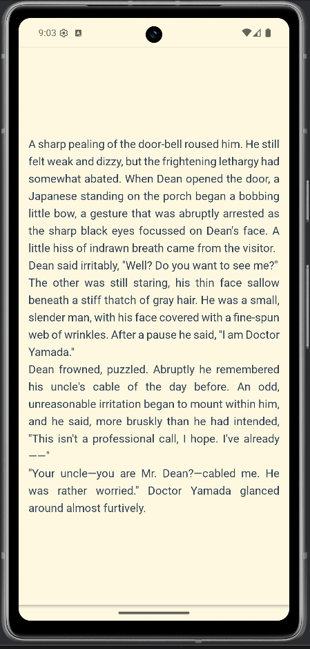

# 📚 Lexify Monorepo (Frontend & Backend)

This repository contains both the **Lexify Frontend (React Native)** and the **Lexify Backend (NestJS)** projects.

- **Frontend:** Mobile app for book-based language learning (React Native, Expo)
- **Backend:** RESTful API for user, book, word, and translation management (NestJS, PostgreSQL)

---

## 🗂️ Project Structure

```
Lexify/
├── frontend/   # React Native mobile app (see details below)
├── backend/    # NestJS backend API (see details below)
```

---

## 🚀 Quick Start

### Frontend (React Native)

See full details below in this README.

- Go to `frontend/` and follow the installation steps.
- Run with `expo start`.

### Backend (NestJS)

See [backend/README.md](backend/README.md) for full documentation.

- Go to `backend/` and follow the installation steps.
- Run with `npm run start:dev` or use Docker.

---

# 📚 Lexify Frontend (React Native)

Lexify is a mobile application that makes language learning fun and efficient, focusing on books and vocabulary. This repository contains the **React Native-based mobile interface** of the app.

---

## 🚀 Features

- 📖 **Book Reading:** Add and read books in PDF and EPUB formats.
- ⭐ **Save Words:** Select and save words as favorites while reading.
- 📚 **Dictionary & Translation:** Fast word search and translation support.
- 📝 **Profile & Statistics:** Track your personal progress and favorite words.
- 🌐 **Multi-language Support:** English and Turkish interface.
- 🖼️ **Modern & User-Friendly Design:** Stylish cards, icons, and themes.
- 🗂️ **Feedback & Settings:** Collect user feedback and manage app settings.

---

## 🖼️ Screenshots

| Login                          | Books                          | Book Reader                              | Help                         |
| ------------------------------ | ------------------------------ | ---------------------------------------- | ---------------------------- |
|  |  |  |  |

---

## 📁 Folder Structure

```
frontend/
├── src/
│   ├── assets/           # Images, icons, book covers
│   ├── components/       # UI components (BookCard, Button, Toast, etc.)
│   ├── contexts/         # Contexts for auth and language management
│   ├── hooks/            # Custom React hooks
│   ├── locales/          # Multi-language files (tr.json, en.json)
│   ├── navigation/       # Navigation (Drawer, Stack)
│   ├── screens/          # All screens (Books, AddBook, Help, etc.)
│   ├── services/         # API and data services
│   ├── types/            # Type definitions
│   └── config/           # App configuration
├── App.tsx               # Entry point
└── README.md             # This file
```

---

## 🛠️ Main Technologies

- **React Native** (Expo)
- **React Navigation** (Drawer + Stack)
- **Context API** (Auth, Language management)
- **TypeScript** support
- **Custom Hooks & Components**
- **Vector Icons** (Ionicons, MaterialCommunityIcons)
- **PDF/EPUB Reader**
- **REST API** connection to backend

---

## ⚙️ Installation

1. **Requirements:**

   - Node.js (v16+)
   - npm or yarn
   - Expo CLI (`npm install -g expo-cli`)

2. **Clone the project:**

   ```bash
   git clone https://github.com/your-username/lexify-frontend.git
   cd lexify-frontend
   ```

3. **Install dependencies:**

   ```bash
   npm install
   # or
   yarn install
   ```

4. **Start the app:**

   ```bash
   expo start
   ```

5. **Test on mobile device:**  
   Scan the QR code with the Expo Go app or run on an emulator.

---

## 🌍 Multi-language Support

- English and Turkish interface with `src/locales/en.json` and `src/locales/tr.json` files.
- Language can be changed from the settings screen.

---

## 🧩 Main Screens & Flow

- **LoginScreen / RegisterScreen:** User login and registration
- **BooksScreen:** Book list and add book
- **BookReaderScreen:** Read books and select words
- **SavedWordsScreen:** Favorite words
- **DictionaryScreen:** Dictionary and translation
- **ProfileScreen:** User profile and statistics
- **SettingsScreen:** Language and app settings
- **HelpScreen:** Public domain book guide and help
- **FeedbackScreen:** Send feedback

---

## 🖼️ Design & Components

- **BookCard:** Card component for books
- **WordSelector:** Select and save words in the reader
- **Toast & Alert:** Notifications and alerts
- **Custom Button & Input:** Custom button and input components

---

## 🔗 Links

- [Backend API (NestJS)](backend/README.md)
- [User Guide & Public Domain Books](https://www.gutenberg.org/), [Standard Ebooks](https://standardebooks.org/), [Manybooks](https://manybooks.net/)

---

## 📝 License

MIT

---

For more information or contributions, please contact the project maintainer or open an issue on GitHub.
